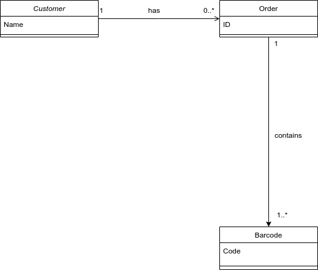
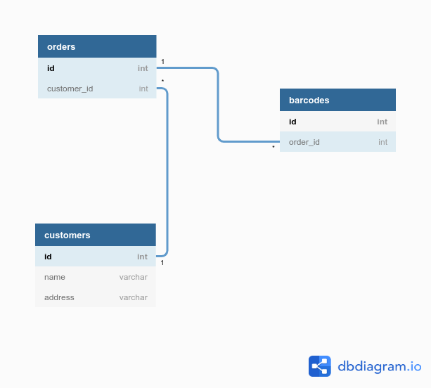

# tq-assignment-v3

I have created 2 scripts with same functionality, one with OOP, the other one without.

```
python3 index_oop.py orders.csv barcodes.csv
```

```
python3 index.py orders.csv barcodes.csv
```

The output file is saved in the same directory as results.csv

Notes
=====
1. I have added some barcodes without orders (check barcode 10, 11)
2. Orders without barcodes are removed from the very beginning.

Class diagram
==============


Database model
==============

